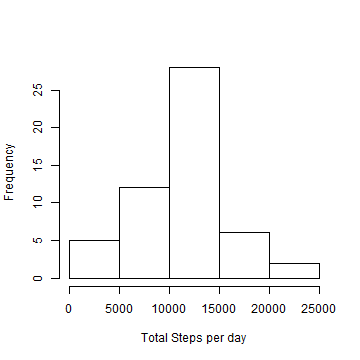
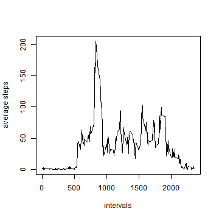
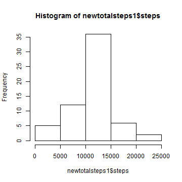

# Reproducible Research: Peer Assessment 1

## Loading and preprocessing the data

* Load the data  

download the data into working directory and read the file

```r
activitydata <- read.csv("activity.csv")
```

  

## Mean of total number of steps taken per day

* Make a histogram of the total number of steps taken each day


```r
activitydata$date <- as.character(activitydata$date)
data <- activitydata[!is.na(activitydata$steps), ]
totalsteps <- tapply(data$steps, data$date, sum)
totalsteps1 <- data.frame(date = names(totalsteps), steps = totalsteps)
hist(totalsteps1$steps, xlab = "Total Steps per day", main = "")
```

 


* Calculate and report the mean and median total number of steps taken per day


```r
mean(totalsteps1$steps)
```

```
## [1] 10766
```

```r
median(totalsteps1$steps)
```

```
## [1] 10765
```


## The average daily activity pattern

* Make a time series plot (i.e. type = "l") of the 5-minute interval (x-axis) and the average number of steps taken, averaged across all days (y-axis)


```r
averagesteps <- tapply(data$steps, data$interval, mean)
averagesteps1 <- data.frame(interval = names(averagesteps), steps = averagesteps)
averagesteps1$interval <- as.numeric(as.character(averagesteps1$interval))
plot(averagesteps1$interval, averagesteps1$steps, type = "l", ylab = "average steps", 
    xlab = "intervals")
```

 


* Which 5-minute interval, on average across all the days in the dataset, contains the maximum number of steps?

The time interval 835 contains the maximum number of steps

```r
averagesteps1[averagesteps1$steps == max(averagesteps1$steps), ]
```

```
##     interval steps
## 835      835 206.2
```


## Imputing missing values

* Calculate and report the total number of missing values in the dataset (i.e. the total number of rows with NAs)

```r
length(activitydata[is.na(activitydata$steps), 1])
```

```
## [1] 2304
```


* Devise a strategy for filling in all of the missing values in the dataset. 

Plan to use the mean steps of the five minute interval to substitue NA value


```r
meansteps <- tapply(data$steps, data$date, mean)
meansteps1 <- data.frame(date = names(meansteps), steps = meansteps)
meansteps1$date <- as.character(meansteps1$date)
newdata <- activitydata
for (i in 1:17568) {
    if (is.na(newdata[i, 1])) {
        newdata[i, 1] <- averagesteps1[averagesteps1$interval == as.numeric(newdata[i, 
            3]), ][, 2]
    }
}
```


* Create a new dataset that is equal to the original dataset but with the missing data filled in
  
Create a new dataset called newdata with the missing data filled in and its structure is as 
follows


```r
str(newdata)
```

```
## 'data.frame':	17568 obs. of  3 variables:
##  $ steps   : num  1.717 0.3396 0.1321 0.1509 0.0755 ...
##  $ date    : chr  "2012-10-01" "2012-10-01" "2012-10-01" "2012-10-01" ...
##  $ interval: int  0 5 10 15 20 25 30 35 40 45 ...
```


* Make a histogram of the total number of steps taken each day and Calculate and report the mean and median total number of steps taken per day. Do these values differ from the estimates from the first part of the assignment? What is the impact of imputing missing data on the estimates of the total daily number of steps?

```r
newtotalsteps <- tapply(newdata$steps, newdata$date, sum)
newtotalsteps1 <- data.frame(date = names(newtotalsteps), steps = newtotalsteps)
hist(newtotalsteps1$steps)
```

 


```r
mean(newtotalsteps1$steps)
```

```
## [1] 10766
```

```r
median(newtotalsteps1$steps)
```

```
## [1] 10766
```

  
mean is the same with the first part of the assignment but the median is different.

## Are there differences in activity patterns between weekdays and weekends?

* Create a new factor variable in the dataset with two levels - "weekday" and "weekend" indicating whether a given date is a weekday or weekend day

```r
newdata$weekday <- weekdays(as.Date(newdata$date))
for (i in 1:17568) {
    if (newdata$weekday[i] %in% c("Saturday", "Sunday")) {
        newdata$ifweekday[i] <- "weekend"
    } else {
        newdata$ifweekday[i] <- "weekday"
    }
}
newdata$ifweekday <- as.factor(newdata$ifweekday)
str(newdata$ifweekday)
```

```
##  Factor w/ 2 levels "weekday","weekend": 1 1 1 1 1 1 1 1 1 1 ...
```


* Make a panel plot containing a time series plot (i.e. type = "l") of the 5-minute interval (x-axis) and the average number of steps taken, averaged across all weekday days or weekend days (y-axis). 

```r
library(reshape2)
datamelt <- melt(newdata, id = c("ifweekday", "interval"), measure.vars = c("steps"))
dcastdata <- dcast(datamelt, ifweekday + interval ~ variable, mean)
library(ggplot2)
ggplot(dcastdata, aes(interval, steps)) + geom_line(stat = "identity") + facet_grid(ifweekday ~ 
    .)
```

 


